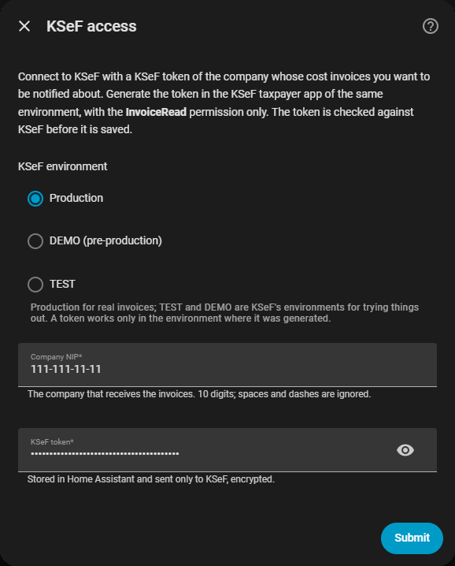
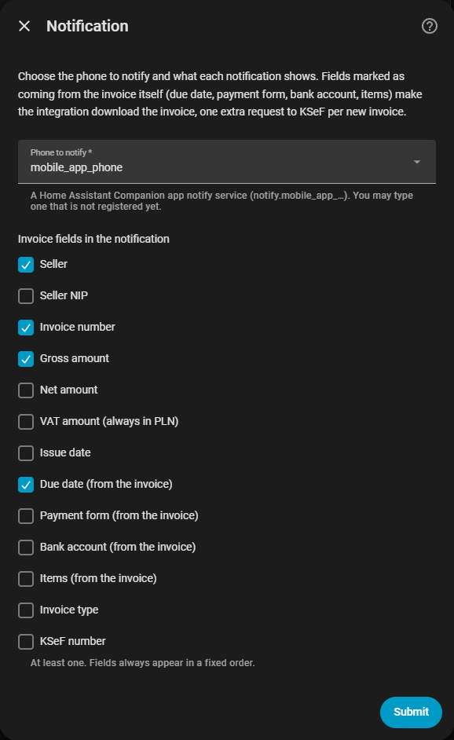
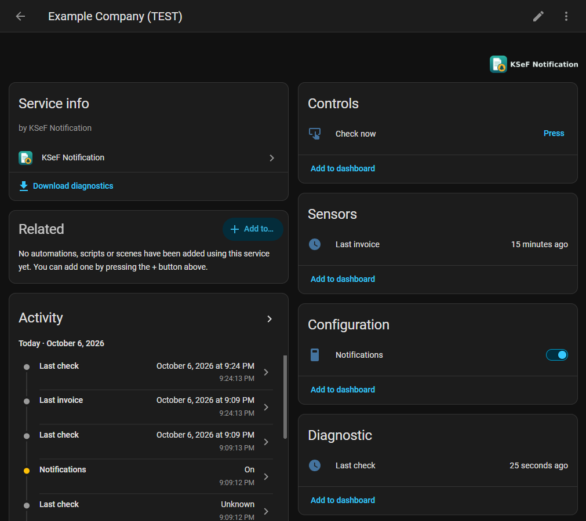

<picture>
  <source media="(prefers-color-scheme: dark)" srcset="custom_components/ksef_notification/brand/dark_logo.png">
  
</picture>

# KSeF Notification

*Polish: „Powiadomienia KSeF"*

[](https://github.com/zyndata/ksef-notification/releases/latest)
[](#hacs-recommended)
[](https://github.com/zyndata/ksef-notification/actions/workflows/validate.yml)
[](https://github.com/zyndata/ksef-notification/actions/workflows/ci.yml)

A [Home Assistant](https://www.home-assistant.io/) custom integration that watches
**KSeF** — the Polish national e-invoice system (Krajowy System e-Faktur) — for new **cost
invoices**, the invoices issued *to* your company, and sends a push notification with the
invoice details you chose to your phone.

It is a notifier, not an archive: an invoice is read, turned into a notification and
forgotten.

> **Unofficial.** This integration is not affiliated with, endorsed by or supported by the
> Ministry of Finance or the KSeF team. It uses KSeF's public API the way any accounting
> program does. Its icon is its own and deliberately does not use the KSeF or Ministry of
> Finance logo.

## What it looks like

A notification as the phone received it, with every field selected except the seller NIP and
the KSeF number (a real run against the KSeF test environment; the invoice is invented):

```
New cost invoice
Biuro Rachunkowe Przykład s.c.
Invoice number: 12/10/2026
Gross: 1,230.00 PLN
Net: 1,000.00 PLN
VAT: 230.00 PLN
Issue date: 2026-10-06
Due date: 2026-10-13
Payment form: Bank transfer
Bank account: 12 3456 7890 1234 5678 9012 3456
Items: 4: Prowadzenie księgowości – wrzesień 2026; Obsługa kadrowo-płacowa; Deklaracje i JPK; +1 more
Invoice type: VAT invoice
```

Setup is a three-step wizard. The first step checks the token against KSeF before it is saved;
the second chooses the phone and what the notification shows:

<p>
  
  
</p>

Each company gets a device with a switch, two sensors and a *Check now* button:



All screenshots come from a real Home Assistant connected to the KSeF test environment; the
company and invoice data in them are invented.

## Features

- **You choose what the notification says** — seller, seller NIP, invoice number, gross, net
  and VAT amounts, issue date, due date, payment form, bank account, line items, invoice type,
  KSeF number. The invoice itself is downloaded only when a field you picked needs it.
- **Nothing historical, nothing missed, nothing twice** — the first check after setup only takes
  note of what is already in KSeF. From then on every new invoice is notified exactly once,
  including the ones that arrived while Home Assistant was down.
- **Readable when many arrive** — up to three invoices in one check are notified one by one;
  from four on, one combined notification lists them.
- **Kind to KSeF's limits** — checks every 15 minutes by default (the shortest interval the
  official guidance allows), with a throttled *Check now* button, and backs off when KSeF asks
  it to.
- **Quiet hours** — optionally, no checks and no notifications at night (or any daily window
  you set); what arrived meanwhile comes in the morning.
- **Fits into automations** — a `ksef_notification_invoice` event for every new invoice, a
  sensor for the most recent invoice, a diagnostic sensor that tells "no new invoices" apart
  from "KSeF has not answered", and a switch to pause notifications.
- **No invoice archive** — no XML, PDF or database on disk. See [Privacy](#privacy).
- **In Polish and English** — the setup, the entities and the notifications. Notifications use
  Home Assistant's own language (Settings → System → General), with Polish amounts and dates
  when it is Polish.

## Requirements

- Home Assistant 2026.9 or newer.
- The **Home Assistant Companion app** on the phone to notify (a `notify.mobile_app_*`
  service).
- A **KSeF token** for the company, generated with the **InvoiceRead** permission only — see
  below.

## Getting a KSeF token

1. Log in to the KSeF taxpayer app (*Aplikacja Podatnika KSeF*) of the environment you want to
   watch, in the context of your company's NIP. For real invoices that is production:
   [ap.ksef.mf.gov.pl](https://ap.ksef.mf.gov.pl).
2. Open **Tokeny → Generuj token**, give it a name (for example "Home Assistant") and tick
   **only** the permission to read invoices (`InvoiceRead`).
3. Generate it and copy the value — it is shown only once.

The token never expires on its own; you can revoke it in the same place at any time. Anyone who
holds it can read your company's invoices, so treat it like a password. A token works only in
the environment and for the NIP it was generated for.

## Installation

### HACS (recommended)

The integration is installed through HACS as a **custom repository** (it is not in the HACS
default list):

1. In HACS, open **⋮ → Custom repositories**, paste
   `https://github.com/zyndata/ksef-notification`, choose the category **Integration** and
   select **Add**.
2. Find **KSeF Notification**, select **Download**, then restart Home Assistant.
3. Go to **Settings → Devices & services → Add integration** and search for
   **KSeF Notification**.

HACS shows new versions as updates, like any other repository.

### Manual

Download the source archive of the
[latest release](https://github.com/zyndata/ksef-notification/releases/latest), copy its
`custom_components/ksef_notification/` folder into the `custom_components/` folder of your Home
Assistant configuration directory and restart Home Assistant. Updates are manual too.

## Configuration

Everything is configured from the UI — a three-step wizard (KSeF access, notification,
behaviour) plus an options flow for later changes (**Settings → Devices & services → KSeF
Notification → Configure**). One entry watches one company in one KSeF environment; add more
entries for more companies, or for the same company in the test environment.

- **KSeF access** — the environment (production for real invoices), the company's NIP and the
  KSeF token. The token is checked with one login and one small query before it is saved.
- **Notification** — the phone (any registered Companion-app phone) and the invoice fields to
  show. The four preselected fields (seller, invoice number, gross amount, due date) make a
  short notification; the due date, payment form, bank account and items come from the invoice
  itself and cost one extra download per new invoice.
- **Behaviour** — how often to check: 15 minutes (the default and the minimum) up to a day;
  and, optionally, **quiet hours** (for example 22:00 to 06:00, in Home Assistant's time zone)
  during which KSeF is not asked at all, so no notification arrives. Invoices that came in
  meanwhile are notified by the first check when the quiet hours end, combined into one
  notification if there are four or more. *Check now* still works during quiet hours.

Adding the integration costs two logins and two invoice queries (the token check and the first
check); after that each check is one query, plus one download per new invoice when a field
needs it — at most a fifth of what KSeF allows per hour at the default interval.

When KSeF stops accepting the token (revoked, or replaced), Home Assistant asks for a new one
(**Re-authenticate**); nothing already notified is notified again.

See [docs/CONFIG.md](docs/CONFIG.md) for every option, every selectable field, the entities and
the event payload.

## Automations

Every new invoice fires a `ksef_notification_invoice` event with the selected fields — also
when it was part of a combined notification. For example, a to-do item due on the invoice's
due date (with the default field selection):

```yaml
triggers:
  - trigger: event
    event_type: ksef_notification_invoice
conditions:
  - condition: template
    value_template: "{{ trigger.event.data.fields.due_date is not none }}"
actions:
  - action: todo.add_item
    target:
      entity_id: todo.bills
    data:
      item: "{{ trigger.event.data.fields.seller_name }} — {{ trigger.event.data.fields.gross_amount }} {{ trigger.event.data.fields.currency }}"
      due_date: "{{ trigger.event.data.fields.due_date }}"
```

The payload is described in [docs/CONFIG.md](docs/CONFIG.md#event-payload). A field that was not
selected is not in it, and a selected field the invoice does not have is `null`.

## Privacy

- **Stored by this integration:** one small file per entry in Home Assistant's own storage,
  holding a KSeF timestamp and short hashes of the invoices already handled — no amount, name,
  number or NIP. Access tokens are kept in memory only.
- **Stored by Home Assistant:** the KSeF token in the config entry, like any integration's
  credentials. Home Assistant's recorder also stores every event, including
  `ksef_notification_invoice` with the fields you selected, and the `call_service` event Home
  Assistant itself fires for every service call — for the notification, that one contains its
  title and text. To keep invoice data out of the database, exclude both:

  ```yaml
  recorder:
    exclude:
      event_types:
        - ksef_notification_invoice
        - call_service
  ```

  Excluding `call_service` drops the record of every service call, not only this
  integration's; Home Assistant offers no narrower way. The *Last invoice* sensor's attributes
  are never recorded.

- **The notification itself** travels through the Companion app's push relay and Google's or
  Apple's push service, and stays in your phone's notification history — it is invoice data by
  definition, so select only the fields you are comfortable sending that way.

## Troubleshooting

- **Nothing arrives.** Look at the *Last check* sensor (on the device page, under
  *Diagnostic*): its `outcome` attribute says whether the last check was `ok`, KSeF was
  `unavailable`, asked to slow down (`rate_limited`), refused the token (`auth_failed`) or
  blocked the account (`blocked`), and `next_check` when the next one runs. Remember that the
  first check after setup notifies nothing by design, and that with quiet hours set no check
  runs inside them.
- **A repair issue** appears under **Settings → System → Repairs** when the phone's notify
  service is missing or a push failed, and when KSeF blocks access for the company.
- **Check now refuses** within 10 minutes of the previous check — KSeF's limits are shared with
  every other program that reads the same company's invoices from the same internet connection.
- **Reporting a bug:** the diagnostics download (the entry's **⋮ → Download diagnostics**)
  already hides the token, the NIP, the phone and every invoice value. Issues are public: never
  post a token, a NIP, a name, an invoice number or an amount.

## Removing

Delete the entry under **Settings → Devices & services**; its stored file goes with it. Then
revoke the token in the KSeF taxpayer app, and remove the integration in HACS if no entry is
left.

## How it works

See [docs/ARCHITECTURE.md](docs/ARCHITECTURE.md) for the design and
[docs/KSEF_API.md](docs/KSEF_API.md) for the part of the KSeF API it uses, its limits and the
request budget.

## Development

See [docs/DEVELOPMENT.md](docs/DEVELOPMENT.md). One command sets up the environment:
`python scripts/setup.py`. To try an unreleased version, deploy a working copy into a test Home
Assistant with `python scripts/install.py`, against the KSeF **test** environment only.

## License

[MIT](LICENSE)
